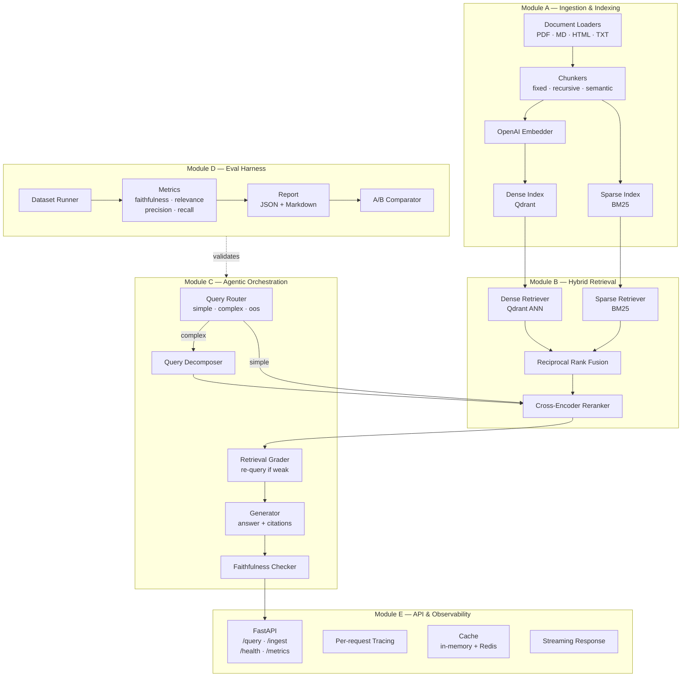

# Atlas — Agentic RAG Platform

A production-grade, self-improving retrieval-augmented generation system for
enterprise knowledge bases. Built as a portfolio centerpiece demonstrating
clean architecture, type safety, full observability, and reproducible evaluation.

---

## Architecture



## Design Rationale

### Why a single shared `interfaces/` package?
Modules A–D are built independently. Defining shared ABCs and Pydantic models
in one place means no circular imports and each module can be tested in
isolation with a stub that satisfies the same contract.

### Why BM25 + dense (hybrid)?
Dense-only retrieval misses exact-match queries (product codes, proper nouns).
BM25-only misses semantic paraphrases. Reciprocal Rank Fusion combines both
without requiring score normalisation — empirically, RRF consistently
outperforms any single retriever on heterogeneous enterprise corpora.

### Why a two-stage retrieve → rerank pipeline?
ANN search scales to millions of vectors in milliseconds but uses bi-encoder
similarity, which is less accurate than cross-encoder scoring. The cross-
encoder is too slow for full-index search (~200 ms per pair) but fast on a
small candidate pool (20–50 chunks). Two stages gives accuracy close to
exhaustive cross-encoder search at ANN latency.

### Why evaluate first?
The eval harness (Module D) is built alongside the retrieval and orchestration
modules, not after. This means every architectural decision is validated against
real metrics before shipping. The `A/B comparator` provides empirical evidence
for claims like "reranking improved context precision by 18%."

---

## Project Layout

```
atlas/
├── src/atlas/
│   ├── interfaces/       # Shared ABCs and Pydantic models (no logic)
│   │   ├── document.py   # Document, Chunk, ChunkMetadata
│   │   ├── loader.py     # BaseDocumentLoader ABC
│   │   ├── chunker.py    # BaseChunker ABC
│   │   ├── embedder.py   # BaseEmbedder ABC + EmbeddingResult
│   │   ├── index.py      # BaseIndex ABC + IndexStats
│   │   ├── retriever.py  # BaseRetriever + RetrievedChunk + RetrievalResult
│   │   ├── reranker.py   # BaseReranker ABC
│   │   ├── llm.py        # BaseLLMProvider + Message + GenerationRequest/Response
│   │   └── evaluator.py  # EvalSample, EvalDataset, MetricScore, EvalResult
│   ├── config.py         # pydantic-settings config (never hardcoded keys)
│   ├── logging.py        # structlog configuration
│   ├── ingestion/        # Module A
│   ├── retrieval/        # Module B
│   ├── orchestration/    # Module C
│   ├── evaluation/       # Module D
│   └── api/              # Module E
├── tests/
│   ├── conftest.py       # Shared fixtures (Documents, Chunks, etc.)
│   ├── unit/             # Pure unit tests, no I/O
│   └── integration/      # Tests against real Qdrant/Redis (docker-compose up first)
├── eval_data/            # Evaluation datasets (JSON) and reports
├── docs/                 # Per-module design docs
├── docker-compose.yml    # Qdrant + Redis + Atlas API
├── Dockerfile
└── pyproject.toml
```

---

## Quick Start

```bash
# 1. Copy env and fill in your OpenAI key
cp .env.example .env && $EDITOR .env

# 2. Start infrastructure
docker-compose up qdrant redis -d

# 3. Install the package (editable)
uv pip install -e ".[dev]"

# 4. Run tests
pytest

# 5. Start the API
uvicorn atlas.api.asgi:app --reload
```

### Docker (all-in-one)
```bash
docker-compose up --build
```

---

## Key Dependencies

| Concern | Library |
|---|---|
| Web framework | FastAPI + uvicorn |
| Config | pydantic-settings |
| Vector store | Qdrant |
| Sparse retrieval | rank-bm25 |
| Embeddings | OpenAI text-embedding-3-small |
| Reranking | sentence-transformers cross-encoder |
| Caching | Redis |
| Logging | structlog |
| Metrics | prometheus-client |
| Dependency management | uv |

---

## Modules

| Module | Status | README |
|---|---|---|
| A — Ingestion & Indexing | ✅ | [docs/ingestion.md](docs/ingestion.md) |
| B — Hybrid Retrieval | ✅ | [docs/retrieval.md](docs/retrieval.md) |
| C — Agentic Orchestration | ✅ | [docs/orchestration.md](docs/orchestration.md) |
| D — Evaluation Harness | ✅ | [docs/evaluation.md](docs/evaluation.md) |
| E — API & Observability | ✅ | [docs/api.md](docs/api.md) |
| Shared Interfaces | ✅ | This file |

---

## Results

Atlas is evaluated on a 30-question set spanning simple factual, multi-hop, negation/constraint, ambiguous, and out-of-scope queries. Metrics are computed by the built-in harness (`scripts/run_eval.py`) against a live index of the sample corpus.

### Headline numbers

| Metric | Score | What it measures |
|---|---|---|
| Context precision | {{CTX_PRECISION}} | Of the chunks retrieved, the fraction that were actually relevant |
| Context recall | {{CTX_RECALL}} | Of the chunks that should have been retrieved, the fraction that were |
| Faithfulness | {{FAITHFULNESS}} | Fraction of answer claims grounded in retrieved context (no hallucination) |
| Answer relevance | {{ANS_RELEVANCE}} | Semantic alignment between the answer and the original question |

*Measured over {{N_SAMPLES}} questions. Scores are directional signal at this sample size, not tight confidence intervals; the eval set is designed to be expanded to several hundred questions for production-grade claims.*

### The impact of reranking (A/B)

The single most consequential design choice is the two-stage retriever: fast ANN search followed by a cross-encoder reranker. Running the identical pipeline with the reranker disabled isolates its contribution.

| Configuration | Context precision | Faithfulness |
|---|---|---|
| Hybrid retrieval, **no** reranker | {{PRECISION_NO_RERANK}} | {{FAITH_NO_RERANK}} |
| Hybrid retrieval **+ cross-encoder reranker** | {{PRECISION_RERANK}} | {{FAITH_RERANK}} |
| **Delta** | **{{PRECISION_DELTA}}** | **{{FAITH_DELTA}}** |

Reranking improved context precision by {{PRECISION_DELTA}} on this eval set. Because the reranker only reorders candidates already retrieved, its gain shows up as precision (better chunks surfaced to the top), which in turn lifts faithfulness (the generator has cleaner context to ground on).

### Where it does well, where it doesn't

Broken down by question category:

| Category | Faithfulness | Notes |
|---|---|---|
| Simple factual | {{FAITH_SIMPLE}} | Single-source lookups; the easy case |
| Multi-hop | {{FAITH_MULTIHOP}} | Requires decomposition; the decomposer's contribution shows here |
| Negation / constraint | {{FAITH_NEGATION}} | The failure mode of naive RAG; precision-sensitive |
| Out-of-scope | {{FAITH_OOS}} | Correct behavior is refusal; measures hallucination resistance |

The honest read: {{ONE_SENTENCE_ON_WEAKEST_CATEGORY}}. This is the next thing I'd improve, likely by {{PROPOSED_FIX}}.

### Reproducing these numbers

```bash
docker-compose up qdrant redis -d
python scripts/ingest.py eval_data/corpus/     # index the sample corpus
python scripts/run_eval.py --report out/eval_report.md
python scripts/run_eval.py --ab reranker       # runs the A/B comparison
```

Reports (JSON + Markdown) are written to `out/`. The A/B comparator applies a 0.02 significance threshold before reporting a delta as meaningful.

### A note on the judge

Faithfulness and answer relevance use an LLM-as-judge. To sanity-check the judge, I hand-labeled {{N_HAND_LABELED}} responses and compared them to the judge's verdicts; agreement was {{JUDGE_AGREEMENT}}. This is a small audit, not a validation study, but it confirms the judge isn't systematically rubber-stamping.
