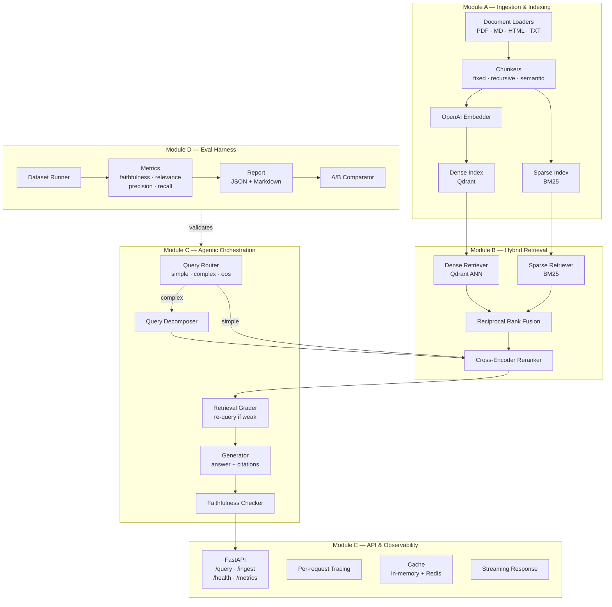

# Atlas — Agentic RAG Platform

A production-grade, self-improving retrieval-augmented generation system for
enterprise knowledge bases. Built as a portfolio centerpiece demonstrating
clean architecture, type safety, full observability, and reproducible evaluation.

---

## Architecture


```mermaid
flowchart TD
    subgraph Ingestion["Module A — Ingestion & Indexing"]
        L[Document Loaders\nPDF · MD · HTML · TXT]
        C[Chunkers\nfixed · recursive · semantic]
        E[OpenAI Embedder]
        DI[Dense Index\nQdrant]
        SI[Sparse Index\nBM25]
        L --> C --> E --> DI
        C --> SI
    end

    subgraph Retrieval["Module B — Hybrid Retrieval"]
        DR[Dense Retriever\nQdrant ANN]
        SR[Sparse Retriever\nBM25]
        RRF[Reciprocal Rank Fusion]
        RR[Cross-Encoder Reranker]
        DR --> RRF
        SR --> RRF
        RRF --> RR
    end

    subgraph Orchestration["Module C — Agentic Orchestration"]
        QR[Query Router\nsimple · complex · oos]
        QD[Query Decomposer]
        RG[Retrieval Grader\nre-query if weak]
        GEN[Generator\nanswer + citations]
        FC[Faithfulness Checker]
        QR -->|complex| QD --> RR
        QR -->|simple| RR
        RR --> RG --> GEN --> FC
    end

    subgraph Evaluation["Module D — Eval Harness"]
        M[Metrics\nfaithfulness · relevance\nprecision · recall]
        RUN[Dataset Runner]
        RPT[Report\nJSON + Markdown]
        AB[A/B Comparator]
        RUN --> M --> RPT
        RPT --> AB
    end

    subgraph API["Module E — API & Observability"]
        FA[FastAPI\n/query · /ingest\n/health · /metrics]
        TR[Per-request Tracing]
        CA[Cache\nin-memory + Redis]
        STR[Streaming Response]
    end

    DI --> DR
    SI --> SR
    FC --> FA
    Evaluation -.->|validates| Orchestration
```

## Design Rationale

### Why a single shared `interfaces/` package?
Modules A–D are built independently. Defining shared ABCs and Pydantic models
in one place means no circular imports and each module can be tested in
isolation with a stub that satisfies the same contract.

### Why BM25 + dense (hybrid)?
Dense-only retrieval misses exact-match queries (product codes, proper nouns).
BM25-only misses semantic paraphrases. Reciprocal Rank Fusion combines both
without requiring score normalisation — empirically, RRF consistently
outperforms any single retriever on heterogeneous enterprise corpora.

### Why a two-stage retrieve → rerank pipeline?
ANN search scales to millions of vectors in milliseconds but uses bi-encoder
similarity, which is less accurate than cross-encoder scoring. The cross-
encoder is too slow for full-index search (~200 ms per pair) but fast on a
small candidate pool (20–50 chunks). Two stages gives accuracy close to
exhaustive cross-encoder search at ANN latency.

### Why evaluate first?
The eval harness (Module D) is built alongside the retrieval and orchestration
modules, not after. This means every architectural decision is validated against
real metrics before shipping. The `A/B comparator` provides empirical evidence
for claims like "reranking improved context precision by 18%."

---

## Project Layout

```
atlas/
├── src/atlas/
│   ├── interfaces/       # Shared ABCs and Pydantic models (no logic)
│   │   ├── document.py   # Document, Chunk, ChunkMetadata
│   │   ├── loader.py     # BaseDocumentLoader ABC
│   │   ├── chunker.py    # BaseChunker ABC
│   │   ├── embedder.py   # BaseEmbedder ABC + EmbeddingResult
│   │   ├── index.py      # BaseIndex ABC + IndexStats
│   │   ├── retriever.py  # BaseRetriever + RetrievedChunk + RetrievalResult
│   │   ├── reranker.py   # BaseReranker ABC
│   │   ├── llm.py        # BaseLLMProvider + Message + GenerationRequest/Response
│   │   └── evaluator.py  # EvalSample, EvalDataset, MetricScore, EvalResult
│   ├── config.py         # pydantic-settings config (never hardcoded keys)
│   ├── logging.py        # structlog configuration
│   ├── ingestion/        # Module A
│   ├── retrieval/        # Module B
│   ├── orchestration/    # Module C
│   ├── evaluation/       # Module D
│   └── api/              # Module E
├── tests/
│   ├── conftest.py       # Shared fixtures (Documents, Chunks, etc.)
│   ├── unit/             # Pure unit tests, no I/O
│   └── integration/      # Tests against real Qdrant/Redis (docker-compose up first)
├── eval_data/            # Evaluation datasets (JSON) and reports
├── docs/                 # Per-module design docs
├── learning/             # Study path: basics → research, mapped to the code
├── planning/             # Status, roadmap, milestones, backlog, decisions
├── docker-compose.yml    # Qdrant + Redis + Atlas API
├── Dockerfile
└── pyproject.toml
```

---

## Quick Start

```bash
# 1. Copy env and fill in your API key (OpenAI, or Gemini via OPENAI_BASE_URL)
cp .env.example .env && $EDITOR .env

# 2. Start infrastructure
docker-compose up qdrant redis -d

# 3. Install the package (editable)
uv pip install -e ".[dev]"

# 4. Run tests
pytest

# 5. Start the API
uvicorn atlas.api.asgi:app --reload
```

### Docker (all-in-one)
```bash
docker-compose up --build
```

---

## Key Dependencies

| Concern | Library |
|---|---|
| Web framework | FastAPI + uvicorn |
| Config | pydantic-settings |
| Vector store | Qdrant |
| Sparse retrieval | rank-bm25 |
| Embeddings | Any OpenAI-compatible endpoint (`OPENAI_BASE_URL`); default `text-embedding-3-small`, live runs use Gemini `gemini-embedding-001` @ 1536-d |
| Reranking | sentence-transformers cross-encoder |
| Caching | Redis |
| Logging | structlog |
| Metrics | prometheus-client |
| Dependency management | uv |

---

## Modules

| Module | Status | README |
|---|---|---|
| A — Ingestion & Indexing | ✅ | [docs/ingestion.md](docs/ingestion.md) |
| B — Hybrid Retrieval | ✅ | [docs/retrieval.md](docs/retrieval.md) |
| C — Agentic Orchestration | ✅ | [docs/orchestration.md](docs/orchestration.md) |
| D — Evaluation Harness | ✅ | [docs/evaluation.md](docs/evaluation.md) |
| E — API & Observability | ✅ | [docs/api.md](docs/api.md) |
| Deployment | ✅ | [docs/deploy.md](docs/deploy.md) |
| Shared Interfaces | ✅ | This file |

---

## Results

Measured 2026-09-20 on the first live run: the full FastAPI documentation
(155 markdown files, 4,021 chunks) indexed into local Qdrant + BM25, queried
through the real pipeline with Gemini (`gemini-3.1-flash-lite` for every LLM
stage, `gemini-embedding-001` at 1536 dims). 15-question set,
`eval_data/fastapi_dataset.json`. Two back-to-back runs; the second is the
noise floor.

### Headline numbers

| Metric | Run 1 | Run 2 | Relabelled | What it measures |
|---|---|---|---|---|
| Context precision | 0.309 | 0.309 | **0.416** | Of the 5 chunks handed to the generator, the fraction from a labelled-relevant document |
| Context recall | 0.667 | 0.667 | **0.778** | Of the labelled-relevant documents, the fraction with at least one chunk retrieved |
| Faithfulness | 1.000 | 1.000 | 1.000 | Fraction of answer claims the judge found grounded in the retrieved context |
| Answer relevance | 0.815 | 0.826 | 0.832 | Cosine similarity between the question and questions regenerated from the answer (RAGAS) |

*15 questions, ~15k tokens and ≈₹0.3 per run, 55–155 s wall clock at
concurrency 4. Retrieval metrics are deterministic run to run; the LLM-judged
one moves by about 0.01. Directional signal at this sample size, not a
confidence interval.*

The "Relabelled" column is the **same pipeline, same index**, re-run after
reading the two misses that were labelling errors (below) and fixing the
dataset, not the code. `eval_data/reports/fastapi-v2-relabel_*.json`.

### The honest read

- **Faithfulness 1.0 is real but cheap here.** Documentation questions with
  five doc chunks in context rarely tempt the generator to invent. The number
  says the pipeline does not hallucinate on easy ground; it does not yet say
  anything about adversarial or negation questions (none in this set).
- **Recall 0.67 → 0.78 by fixing labels, not code.** Of the first run's
  5 misses, two were labelling problems: "how do you stream a large file" is
  answered in `advanced/stream-data` and `tutorial/stream-json-lines` as well
  as `advanced/custom-response`, and the only page that states a Python
  version floor is `release-notes` (3.10+), not `index`. Relabelled, both
  hit. The remaining three are genuine retrieval misses (`tutorial/body`,
  `tutorial/response-model`, `tutorial/security/*`) where chunks from
  adjacent tutorial pages outranked the target — those are the M3 work.
- **Precision 0.42 is the number to move.** With `reranker.top_k = 5` and
  one relevant document per question, the ceiling is ~0.2–0.6 per sample;
  the three misses above score 0 and pull it down. First experiments
  (planned, M3): rerank top-k 10–15 (`run_eval.py --set reranker.top_k=10`),
  HyDE query expansion, contextual chunk headers.

### Smoke test, same day

Five hand-written questions through the HTTP API: four in-scope questions
answered with 3–5 citations each and faithfulness 1.0; one off-corpus question
("what does the capital of France have to do with FastAPI") stopped at the
router with no retrieval. p50 latency ≈7 s uncached, <1 ms on a cache hit;
the reranker's first call after a cold start adds ~5 s.

### What the first live run found

Every one of these was invisible to 252 green unit tests:

| Found | Fix |
|---|---|
| Re-ingesting duplicated the whole corpus (ids were `uuid4` per run) | Deterministic `uuid5` ids; re-ingest of an unchanged corpus is 0.3 s and zero API calls |
| CLI ingested into one Qdrant collection, the API read another; BM25 shared one file across namespaces | Namespace resolves both the collection and `data/index/<ns>/bm25_index.json` |
| Router rejected every FastAPI question as "general coding help" | `ROUTER_DOMAIN` describes the corpus to the router |
| Pinned Qdrant image predated the client's `query_points` API (404 on every search) | Image bumped to v1.15.4 |
| Eval matched dataset doc ids against ingester uuids (could only score 0) | Match on corpus-relative path |
| Faithfulness judge JSON truncated at 512 tokens on long answers | 2048 tokens, short evidence strings, judge failure flagged not fatal |

### Reproducing these numbers

```bash
make docker-up                         # Qdrant + Redis
python scripts/fetch_corpus.py --max-files 1000
make ingest                            # ≈₹3.5 in embeddings the first time, free after
make eval                              # ≈₹1.5, writes eval_data/reports/<run>_<stamp>.{json,md}
make eval-compare BASELINE=eval_data/reports/<previous>.json
```

The A/B comparator applies a 0.02 significance threshold before reporting a
delta as meaningful.
