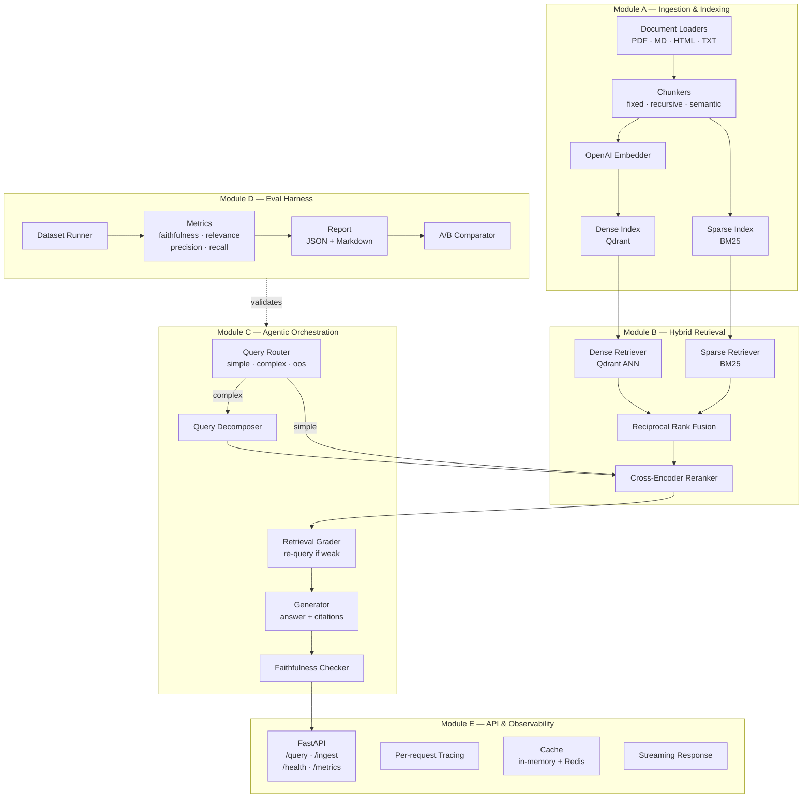

# Atlas — Agentic RAG Platform

A production-grade, self-improving retrieval-augmented generation system for
enterprise knowledge bases. Built as a portfolio centerpiece demonstrating
clean architecture, type safety, full observability, and reproducible evaluation.

**Live:** [atlas.hulage.in](https://atlas.hulage.in) — console at
[/app](https://atlas.hulage.in/app), OpenAPI at
[/docs](https://atlas.hulage.in/docs). Cloud Run with scale-to-zero, so the
first request after an idle spell waits ~15 s for the container.

---

## Architecture


```mermaid
flowchart TD
    subgraph Ingestion["Module A — Ingestion & Indexing"]
        L[Document Loaders\nPDF · MD · HTML · TXT]
        C[Chunkers\nfixed · recursive · semantic]
        E[OpenAI Embedder]
        DI[Dense Index\nQdrant]
        SI[Sparse Index\nBM25]
        L --> C --> E --> DI
        C --> SI
    end

    subgraph Retrieval["Module B — Hybrid Retrieval"]
        DR[Dense Retriever\nQdrant ANN]
        SR[Sparse Retriever\nBM25]
        RRF[Reciprocal Rank Fusion]
        RR[Cross-Encoder Reranker]
        DR --> RRF
        SR --> RRF
        RRF --> RR
    end

    subgraph Orchestration["Module C — Agentic Orchestration"]
        QR[Query Router\nsimple · complex · oos]
        QD[Query Decomposer]
        RG[Retrieval Grader\nre-query if weak]
        GEN[Generator\nanswer + citations]
        FC[Faithfulness Checker]
        QR -->|complex| QD --> RR
        QR -->|simple| RR
        RR --> RG --> GEN --> FC
    end

    subgraph Evaluation["Module D — Eval Harness"]
        M[Metrics\nfaithfulness · relevance\nprecision · recall]
        RUN[Dataset Runner]
        RPT[Report\nJSON + Markdown]
        AB[A/B Comparator]
        RUN --> M --> RPT
        RPT --> AB
    end

    subgraph API["Module E — API & Observability"]
        FA[FastAPI\n/query · /ingest\n/health · /metrics]
        TR[Per-request Tracing]
        CA[Cache\nin-memory + Redis]
        STR[Streaming Response]
    end

    DI --> DR
    SI --> SR
    FC --> FA
    Evaluation -.->|validates| Orchestration
```

## Design Rationale

### Why a single shared `interfaces/` package?
Modules A–D are built independently. Defining shared ABCs and Pydantic models
in one place means no circular imports and each module can be tested in
isolation with a stub that satisfies the same contract.

### Why BM25 + dense (hybrid)?
Dense-only retrieval misses exact-match queries (product codes, proper nouns).
BM25-only misses semantic paraphrases. Reciprocal Rank Fusion combines both
without requiring score normalisation — empirically, RRF consistently
outperforms any single retriever on heterogeneous enterprise corpora.

### Why a two-stage retrieve → rerank pipeline?
ANN search scales to millions of vectors in milliseconds but uses bi-encoder
similarity, which is less accurate than cross-encoder scoring. The cross-
encoder is too slow for full-index search (~200 ms per pair) but fast on a
small candidate pool (20–50 chunks). Two stages gives accuracy close to
exhaustive cross-encoder search at ANN latency.

### Why evaluate first?
The eval harness (Module D) is built alongside the retrieval and orchestration
modules, not after. This means every architectural decision is validated against
real metrics before shipping. The `A/B comparator` provides empirical evidence
for claims like "reranking improved context precision by 18%."

---

## Project Layout

```
atlas/
├── src/atlas/
│   ├── interfaces/       # Shared ABCs and Pydantic models (no logic)
│   │   ├── document.py   # Document, Chunk, ChunkMetadata
│   │   ├── loader.py     # BaseDocumentLoader ABC
│   │   ├── chunker.py    # BaseChunker ABC
│   │   ├── embedder.py   # BaseEmbedder ABC + EmbeddingResult
│   │   ├── index.py      # BaseIndex ABC + IndexStats
│   │   ├── retriever.py  # BaseRetriever + RetrievedChunk + RetrievalResult
│   │   ├── reranker.py   # BaseReranker ABC
│   │   ├── llm.py        # BaseLLMProvider + Message + GenerationRequest/Response
│   │   └── evaluator.py  # EvalSample, EvalDataset, MetricScore, EvalResult
│   ├── config.py         # pydantic-settings config (never hardcoded keys)
│   ├── logging.py        # structlog configuration
│   ├── ingestion/        # Module A
│   ├── retrieval/        # Module B
│   ├── orchestration/    # Module C
│   ├── evaluation/       # Module D
│   └── api/              # Module E
├── tests/
│   ├── conftest.py       # Shared fixtures (Documents, Chunks, etc.)
│   ├── unit/             # Pure unit tests, no I/O
│   └── integration/      # Tests against real Qdrant/Redis (docker-compose up first)
├── eval_data/            # Evaluation datasets (JSON) and reports
├── docs/                 # Per-module design docs
├── learning/             # Study path: basics → research, mapped to the code
├── planning/             # Status, roadmap, milestones, backlog, decisions
├── docker-compose.yml    # Qdrant + Redis + Atlas API
├── Dockerfile
└── pyproject.toml
```

---

## Quick Start

```bash
# 1. Copy env and fill in your API key (OpenAI, or Gemini via OPENAI_BASE_URL)
cp .env.example .env && $EDITOR .env

# 2. Start infrastructure
docker-compose up qdrant redis -d

# 3. Install the package (editable)
uv pip install -e ".[dev]"

# 4. Run tests
pytest

# 5. Start the API
uvicorn atlas.api.asgi:app --reload
```

### Docker (all-in-one)
```bash
docker-compose up --build
```

---

## Key Dependencies

| Concern | Library |
|---|---|
| Web framework | FastAPI + uvicorn |
| Config | pydantic-settings |
| Vector store | Qdrant |
| Sparse retrieval | rank-bm25 |
| Embeddings | Any OpenAI-compatible endpoint (`OPENAI_BASE_URL`); default `text-embedding-3-small`, live runs use Gemini `gemini-embedding-001` @ 1536-d |
| Reranking | sentence-transformers cross-encoder |
| Caching | Redis |
| Logging | structlog |
| Metrics | prometheus-client |
| Dependency management | uv |

---

## Modules

| Module | Status | README |
|---|---|---|
| A — Ingestion & Indexing | ✅ | [docs/ingestion.md](docs/ingestion.md) |
| B — Hybrid Retrieval | ✅ | [docs/retrieval.md](docs/retrieval.md) |
| C — Agentic Orchestration | ✅ | [docs/orchestration.md](docs/orchestration.md) |
| D — Evaluation Harness | ✅ | [docs/evaluation.md](docs/evaluation.md) |
| E — API & Observability | ✅ | [docs/api.md](docs/api.md) |
| Deployment | ✅ | [docs/deploy.md](docs/deploy.md) |
| Shared Interfaces | ✅ | This file |

---

## Results

Measured 2026-09-20 on the first live run: the full FastAPI documentation
(155 markdown files, 4,021 chunks) indexed into local Qdrant + BM25, queried
through the real pipeline with Gemini (`gemini-3.1-flash-lite` for every LLM
stage, `gemini-embedding-001` at 1536 dims). 15-question set,
`eval_data/fastapi_dataset.json`. Two back-to-back runs; the second is the
noise floor.

### Headline numbers

| Metric | Run 1 | BM25 tokeniser | `top_k` 15 | **Current** | *+ headers* | What it measures |
|---|---|---|---|---|---|---|
| Context precision | 0.482 | 0.498 | 0.373 | **0.387** | *0.467* | Of the chunks handed to the generator, the fraction from a labelled-relevant document |
| Context recall | 0.682 | 0.736 | 0.924 | **0.933** | *0.938* | Of the labelled-relevant documents, the fraction with at least one chunk retrieved |
| Faithfulness | 1.000 | 1.000 | 1.000 | **1.000** | *1.000* | Fraction of answer claims the judge found grounded in the retrieved context |
| Answer relevance | 0.815 | 0.825 | 0.819 | **0.827** | *0.833* | Cosine similarity between the question and questions regenerated from the answer (RAGAS) |

Every context number in that row is a **replay**, not a re-run. Chunk ids are
`uuid5(document_id(source), chunk_index)` and every stored report keeps the
ids it retrieved, so both context metrics — which are set arithmetic over
document ids — can be recomputed against any label set for free, for every
run ever recorded. `scripts/replay_context_metrics.py` does it, and checks
itself by reproducing the stored score of every sample whose label did not
change. That mattered on 2026-09-27, when the dataset was audited and nine of
fifteen rows moved; without the replay, honest numbers would have cost an
eval run per column.

**What the audit was.** Read each row's reference answer, list the claims it
makes, `grep` the corpus for each one. Two failure modes, in opposite
directions, and both were present: an answer that rests on more pages than
its label names (`fq-012` needed five, had one), and an answer that names
things the corpus does not contain at all (`fq-010` prescribed
`run_in_threadpool` and `asyncio.run_in_executor`, neither of which occurs
anywhere in these 155 pages). One row had a required page that supported none
of its claims. One row was categorised out-of-scope on a page the corpus in
fact has. Nothing in the harness could have caught any of it — see the note
on correctness below.

A column that used to sit here, "Relabelled", is gone. It was the same
pipeline and the same index re-run after two labelling errors were fixed, so
under one consistent label set it is the same measurement as Run 1 — which is
what the replay shows. A labelling fix is not a result.

The italic column is measured but **not shipped**: context headers change every
chunk's indexed text, so they live in a separate corpus namespace until a
re-ingest of the live one is paid for. It is the largest precision gain in the
table. It is **not** a recall gain — recall goes very slightly down, and the
claim it made earlier today, that headers recovered a question nothing had
ever retrieved, was an artifact of `fq-012`'s old label and is withdrawn.

**None of the four numbers in that table is a correctness metric, and the
table is weaker than it looks because of it.** The dataset carries a
reference answer per question, and until 2026-09-28 no metric read it:
precision and recall score the retrieved documents, faithfulness scores the
answer against the chunks it was given, and answer relevance scores the
question against questions regenerated from the answer. All four can be
perfect on an answer that is grounded, on-topic and wrong. Read faithfulness
1.000 as "it did not invent anything beyond its context", not as "it was
right".

A fifth metric, `answer_correctness`, now closes that gap in code:
`AnswerCorrectnessMetric` decomposes the reference answer into facts and
marks each one present, missing or contradicted in the generated answer,
scoring `(present - contradicted) / total` — a contradiction costs twice
what an omission does, because an incomplete answer and a wrong one are
different failures. Extra correct material the reference does not mention is
deliberately not penalised: these references are hand-written summaries, and
`fq-012`'s correct answer legitimately spans five pages where its reference
names one.

**It has not been run yet, so there is no correctness column above and no
correctness claim anywhere in this README.** The number costs a full eval
pass to obtain and will appear here when one is paid for, whatever it says.

*15 questions, 36k tokens and ≈₹0.70 per run, 55–155 s wall clock at
concurrency 4. Retrieval metrics are deterministic run to run — the identical
config a day apart reproduced three of them to four decimal places — and the
LLM-judged one moves by about 0.01. Directional signal at this sample size,
not a confidence interval.*

**All fifteen rows are in these numbers.** Until 2026-09-27 one of them
(`fq-015`, on WebSockets with a React frontend) was labelled out of scope with
no relevant document, on the reasoning that the correct answer was a refusal
and so its precision was a structural zero worth discarding. That was wrong:
`advanced/websockets.md` is in the corpus, its "WebSockets client" section
names React, and the pipeline answers the question from it with citations and
faithfulness 1.000. A precision of 0.467 was being recorded as 0.0 and then
thrown away. The metrics still skip a row that has no relevant document —
that guard is correct — but this dataset no longer has such a row, which is
its own gap and is in BACKLOG.

"Current" is `main` as it stands: `reranker.top_k = 15` against the Qdrant
Cloud index, with a retry that accumulates context instead of replacing it
and a sub-query merge that is cut back to one window. The last two are not on
`atlas.hulage.in` yet — the live revision predates them and a deploy is a
manual step. Three changes, measured one at a time, each against the run
before it:

- **Widening the window** (`reranker.top_k` 5 → 15) bought recall
  0.736 → 0.924 and cost precision, 0.498 → 0.373. That is the real trade in
  this table and the only change that bought recall worth the name.
- **Making the retry additive** moved recall 0.924 → 0.933 and cost precision
  0.373 → 0.348. A retry used to replace the window it had, so a grader that
  wrongly called a window insufficient destroyed documents already retrieved;
  fixing that is right on the merits, but it widens the window and two rows
  pay for it in precision. Both movements are at or inside the 0.02 floor.
- **Capping the sub-query merge** bought precision 0.348 → 0.387 at identical
  recall, and gave back 19% of the tokens. A decomposed question had been
  handing the generator `sub_queries × top_k` chunks — 41 for one sample
  against a configured window of 15. This is the change that pays back what
  the retry fix cost.

Both of the last two re-rank against the *original* question rather than a
sub-query or a reformulation, because those scores are each relative to a
different question and cannot be interleaved as they stand.
`eval_data/reports/merge-capped_20260927-114923.json`.

**Replicated.** The identical config re-run a day later returned precision
0.3022, recall 0.9000 and faithfulness 1.0000 — the same to four decimal
places; only answer relevance moved, 0.819 → 0.828, inside the floor. Worth
stating because the run in between *did* move: it fell back to the secondary
model after the primary returned 503, and shifted recall and faithfulness by
0.067 each on an unchanged config. Reports now record which model served
them, so a run like that announces itself instead of being read as variance.

**Read the precision drop as a denominator, not a regression.** Each question
labels one relevant document, so with a 15-slot window a perfect retrieval
still scores about 0.2–0.4: the other slots have nothing relevant left to
hold. Nothing got worse — the window got wider and the metric is a fraction
of it. Recall, faithfulness and answer relevance are the ones that carry
meaning across a `top_k` change, and they went up, flat, flat.

### The honest read

- **Faithfulness 1.0 is real but cheap here.** Documentation questions with
  five doc chunks in context rarely tempt the generator to invent. The number
  says the pipeline does not hallucinate on easy ground; it does not yet say
  anything about adversarial or negation questions (none in this set).
- **Recall 0.67 → 0.78 by fixing labels, not code.** Of the first run's
  5 misses, two were labelling problems: "how do you stream a large file" is
  answered in `advanced/stream-data` and `tutorial/stream-json-lines` as well
  as `advanced/custom-response`, and the only page that states a Python
  version floor is `release-notes` (3.10+), not `index`. Relabelled, both
  hit. The remaining three are genuine retrieval misses (`tutorial/body`,
  `tutorial/response-model`, `tutorial/security/*`) where chunks from
  adjacent tutorial pages outranked the target — those are the M3 work.
- **The misses were never unreachable.** Widening the reranker window from 5
  to 15 recovered `advanced/custom-response` and `tutorial/response-model`
  outright and took `tutorial/security/oauth2-jwt` from 0 to 0.5 — documents
  that had survived every M1 attempt. They had been sitting just below rank 5
  the whole time, in the candidate set, discarded by the window rather than
  missed by the retriever. The cost is 2.45x the generator tokens
  (~\$0.0005 → ~\$0.0012 per query) and faithfulness held at 1.000, which
  was the risk worth checking: more context is where lost-in-the-middle
  shows up.
- **`fq-012` is the one left.** "Does FastAPI require Pydantic, or can you
  skip it entirely?" — a comparative question whose answer is spread across
  pages rather than stated on one. Query decomposition finds it at
  `top_k` 5 and the wider window does not. That shape needs
  decomposition or contextual chunk headers, not more slots.
  *(Superseded 2026-09-27. "Finds it" was one page of five: the sample was
  labelled with a single document when its answer rests on plain type hints,
  `Query()`, `Path()`, singular-value `Body()` and the one place Pydantic is
  genuinely required. It was never fully retrieved by any configuration and
  never an outright miss either. The diagnosis of the question's shape was
  right; the scoreboard reading it produced was not.)*
- **Next experiments (M3):** `retrieval.top_k` 20 → 40 (the reranker
  currently keeps 15 of 20, so it barely filters — retrieval-only recall
  measures 0.964 there, unconfirmed end to end), HyDE query expansion,
  contextual chunk headers.
- **Better tokenisation and query decomposition are substitutes, not
  additions.** The identifier-aware BM25 tokeniser is worth +0.07 recall when
  the raw question goes straight to the retriever, which is what
  `scripts/eval_retrieval.py` measures. Through the full pipeline it is worth
  little: recall 0.682 → 0.736, +0.054, and most of that is one sample. Per
  sample it is a swap, not a wash — `fq-005` goes 0 → 1.0 while `fq-012` goes
  0.4 → 0.2, both at the rank-5 boundary. Decomposition was already recovering
  what the tokeniser recovers, so the two compete for the same five slots. It
  ships anyway, because the router sends "simple" questions down a path that
  never decomposes, and that path is measurably better with it — but the cheap
  harness over-credits any retrieval change, and this is the correction.
  *(Numbers restated 2026-09-27 after the dataset audit; the original text read
  "0.778 either way" and "`fq-012` goes 1.0 → 0", both of which were the old
  one-document label talking.)*

### Smoke test, same day

Five hand-written questions through the HTTP API: four in-scope questions
answered with 3–5 citations each and faithfulness 1.0; one off-corpus question
("what does the capital of France have to do with FastAPI") stopped at the
router with no retrieval. p50 latency ≈7 s uncached, <1 ms on a cache hit;
the reranker's first call after a cold start adds ~5 s.

**Latency as measured 2026-09-24, at `top_k` 15:** p50 **15.0 s** per query,
p95 24.7 s, and a live production query the same hour took 15.7 s. That is six
sequential LLM round trips at roughly 2.5 s each. It is not the wider window:
the slowest stage is *grading* at 3.5 s, which sees only the top five chunks
whatever `top_k` says, while generation (2.9 s) and faithfulness (3.0 s) — the
two stages that read all fifteen — come in under it. Shortening this means
removing a call from the pipeline, not narrowing the window. The ≈7 s above
was measured differently, in September, and is not a baseline to diff against.

### What the first live run found

Every one of these was invisible to 252 green unit tests:

| Found | Fix |
|---|---|
| Re-ingesting duplicated the whole corpus (ids were `uuid4` per run) | Deterministic `uuid5` ids; re-ingest of an unchanged corpus is 0.3 s and zero API calls |
| CLI ingested into one Qdrant collection, the API read another; BM25 shared one file across namespaces | Namespace resolves both the collection and `data/index/<ns>/bm25_index.json` |
| Router rejected every FastAPI question as "general coding help" | `ROUTER_DOMAIN` describes the corpus to the router |
| Pinned Qdrant image predated the client's `query_points` API (404 on every search) | Image bumped to v1.15.4 |
| Eval matched dataset doc ids against ingester uuids (could only score 0) | Match on corpus-relative path |
| Faithfulness judge JSON truncated at 512 tokens on long answers | 2048 tokens, short evidence strings, judge failure flagged not fatal |

### Reproducing these numbers

```bash
make docker-up                         # Qdrant + Redis
python scripts/fetch_corpus.py --max-files 1000
make ingest                            # ≈₹3.5 in embeddings the first time, free after
make eval                              # ≈₹1.5, writes eval_data/reports/<run>_<stamp>.{json,md}
make eval-compare BASELINE=eval_data/reports/<previous>.json
```

The A/B comparator applies a 0.02 significance threshold before reporting a
delta as meaningful.
